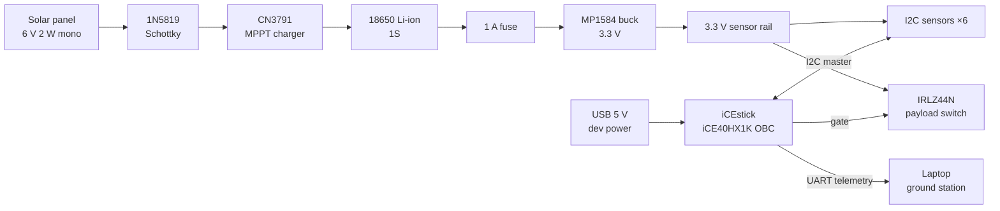

# Jenga — Sustainable FPGA CubeSat

> Submitted to the **AESS Sustainability Hackathon 2026, Challenge 1:
> Sustainable Electronics for Space Systems**. Originally developed
> under the working name *EcoSat*; the old repository URL redirects
> here.

Jenga is an **FPGA-based CubeSat On-Board Computer (OBC) prototype**. A
single Lattice iCE40HX1K FPGA (iCEstick) implements the satellite's
control plane — power management, task scheduling, orbit-state logic —
and its data plane — CAN packet filtering, RLE telemetry compression,
and FIR sensor filtering — entirely as lightweight HDL finite-state
machines. No soft CPU, no operating system, no vendor IP.

The core claim is unchanged from the original EcoSat study: satellite
electronics should not consume full power when the mission state does
not require it. The OBC switches loads between active, low-rate, sleep,
and off modes across sunlight and eclipse phases.

## Key Results

These values are generated by `python3 simulation/main.py` from the
**flight reference power model** (see "Two layers" below).

| Scenario | Average power | Energy per orbit | Energy saved vs baseline |
| --- | ---: | ---: | ---: |
| Baseline always-on electronics | `242.55 mW` | `384.04 mWh` | `0.00%` |
| Modular duty-cycled design | `126.54 mW` | `200.35 mWh` | `47.83%` |
| MCU + FPGA burst design | `70.41 mW` | `111.49 mWh` | `70.97%` |
| Safe mode, low battery (operating-case check) | `27.28 mW` | `43.20 mWh` | — |

The **modular duty-cycled design** is the conservative main result. The
**FPGA burst design** is an extension scenario and depends on the
assumption that FPGA compression/filtering reduces radio active time.
The **safe mode** case is not a savings claim: it demonstrates policy
behavior when battery SOC falls below the 35% FPGA-activation
threshold — the scheduler sheds load (no FPGA burst, comms limited to a
3-minute beacon) to prioritize recharge.

The same run renders the comparison plots into `results/graphs/`
(power-vs-time across one orbit, scenario comparison, battery cycling).

## Two layers: reference model and bench prototype

| Layer | What it is | Where |
| --- | --- | --- |
| **Flight reference model** | Deterministic Python power/orbit model comparing a monolithic always-on stack against the duty-cycled architecture, using published datasheet currents (STM32L496-class OBC, CC1120-class radio, etc.). All headline numbers come from here. | `simulation/`, `results/` |
| **Bench prototype (Jenga OBC)** | The same power policy executed in real hardware: the iCE40HX1K FPGA is the OBC, fed by a real solar-charged Li-ion power chain and a six-device I2C sensor suite. | `rtl/`, `docs/architecture/`, `docs/BOM.md` |

The reference model's component names (STM32L496, CC1120, …) are the
documented basis of the energy figures and are deliberately retained;
they describe the *modeled* flight stack, not the bench hardware.

## Prototype hardware

Full details: [`docs/architecture/SYSTEM_ARCHITECTURE.md`](docs/architecture/SYSTEM_ARCHITECTURE.md),
the drawn wiring schematic
[`docs/architecture/schematic.png`](docs/architecture/schematic.png),
and [`docs/BOM.md`](docs/BOM.md).



| Function | Part |
| --- | --- |
| Energy harvesting | 6 V 2 W monocrystalline solar panel |
| Charge control | CN3791 MPPT single-cell Li-ion charger |
| Storage | 18650 Li-ion cell (1S) |
| Protection | 1N5819 Schottky (reverse block), 1 A fuse |
| Regulation | MP1584 buck → 3.3 V |
| OBC | Lattice iCEstick (iCE40HX1K, TQ144, 12 MHz) |
| Sensors (shared I2C, single FPGA master) | MPU6050 (IMU, `0x69`), HMC5883L (mag, `0x1E`), BH1750 (lux, `0x23`), INA226 (power, `0x40`), MCP9808 (temp, `0x18`), DS3231 (RTC, `0x68`) |
| Payload switch | IRLZ44N logic-level MOSFET |
| Links | UART (telemetry to ground-station laptop), shared I2C bus |

During development the FPGA is powered over USB; the solar/battery
chain powers the 3.3 V sensor rail. All grounds are common.

## OBC FPGA modules

Everything is plain Verilog-2001 FSM/datapath logic — **no soft CPU, no
Linux, no DSP macros** — sized for the HX1K's 1280 logic cells.

| Module | Status | Files |
| --- | --- | --- |
| Orbit controller (sunlight/eclipse state, prescalable tick) | ✅ implemented, synthesized | `rtl/top/orbit_controller.v` |
| Task scheduler (workload gating by orbit state) | ✅ implemented, synthesized | `rtl/top/scheduler.v` |
| Power controller (FPGA-burst + comms rail enables) | ✅ implemented, synthesized | `rtl/top/power_controller.v` |
| CAN packet filter (whitelist classifier) | ✅ implemented, synthesized | `rtl/can_filter/` |
| RLE telemetry compressor | ✅ implemented, synthesized | `rtl/compression/rle_compressor.v` |
| FIR sensor filter (shift-add taps, no multipliers) | ✅ implemented, synthesized | `rtl/fir_filter/fir_filter.v` |
| Telemetry framing + buffer | 🟡 scaffold (`packet_encoder.v`, `telemetry_buffer.v`), integration on roadmap | `rtl/compression/` |
| UART telemetry TX | 🟡 stub only (`uart_debug.v` is a placeholder, not a functional UART) | `rtl/common/` |
| I2C master + sensor sequencer | 🔜 roadmap (single master, round-robin over 6 devices) | — |

Resource budget and fit analysis for the full OBC on the HX1K:
`docs/architecture/SYSTEM_ARCHITECTURE.md` §8.

## Quickstart

From the repository root:

```bash
python3 simulation/main.py
python3 tests/run_tests.py
./rtl/simulations/iverilog/run_iverilog.sh
gcc -DPMEP_DEMO_MAIN src/pmep_module_manager.c -o pmep_demo && ./pmep_demo
```

The first command regenerates all simulation outputs (CSVs, report, and
plots if matplotlib is installed). The second runs a zero-dependency
test suite for the core model, orbit logic, scheduler policy, FPGA
activation policy, and energy calculations. The third compiles and runs
the self-checking RTL testbenches with Icarus Verilog. The fourth
builds and runs the PMEP plug-and-play protocol demo.

If you install the optional Python dependencies:

```bash
python3 -m pip install -r requirements.txt
python3 -m pytest
```

## Generated Outputs

Simulation outputs are written under `results/`:

| File | Purpose |
| --- | --- |
| `results/csv/baseline_power.csv` | Baseline always-on power and energy |
| `results/csv/optimized_power.csv` | Scenario-level optimized power metrics |
| `results/csv/orbit_energy.csv` | Energy-per-orbit comparison |
| `results/csv/battery_lifetime.csv` | Battery-cycle and extension estimates |
| `results/csv/scenario_phase_power.csv` | Phase-by-phase load breakdown |
| `results/reports/simulation_summary.md` | Human-readable result summary |
| `results/graphs/power_vs_time.png` | Power profile across one orbit, eclipse shaded |
| `results/graphs/scenario_comparison.png` | Average power and energy per orbit, per scenario |
| `results/graphs/battery_cycles.png` | Equivalent full battery cycles per year |

## RTL Evidence

| Folder | Contents |
| --- | --- |
| `rtl/fir_filter/` | FIR filter datapath and testbench |
| `rtl/compression/` | RLE compressor, packet encoder, telemetry buffer, testbench |
| `rtl/can_filter/` | CAN packet classifier/filter and testbench |
| `rtl/top/` | Orbit controller, scheduler, power controller, OBC top level |
| `rtl/common/` | FIFO, edge detector, debounce, UART stub |
| `rtl/simulations/iverilog/` | Icarus Verilog build-and-run script |
| `rtl/synthesis/vivado/` | Vivado batch/GUI flow scripts and OOC constraints |
| `rtl/synthesis/icestick/` | Open-source Yosys/nextpnr flow for iCE40HX1K |
| `rtl/synthesis_reports/` | Generated utilization, timing, and power reports |

With Icarus Verilog installed:

```bash
./rtl/simulations/iverilog/run_iverilog.sh
```

All three testbenches are **self-checking**: each compares the DUT
output against a golden reference model (FIR tap arithmetic, expected
RLE run pairs, CAN whitelist forwarding) and prints a single
`PASS`/`FAIL` summary line. The script exits nonzero if any testbench
fails, and writes waveform VCDs to a temporary build directory.

> The synthesized top level is named `fpga_accelerator_top` for
> traceability with the committed synthesis reports; it is the OBC core
> (renaming to `obc_top` is a post-freeze roadmap item).

### Vivado implementation evidence

The OBC core (`rtl/top/fpga_accelerator_top.v`) is implemented
out-of-context with Vivado 2025.2 for two targets. Reports live in
`rtl/synthesis_reports/` and regenerate with
`./rtl/synthesis/vivado/run_vivado.sh`, or from the Vivado GUI Tcl
console (see the header of `rtl/synthesis/vivado/run_vivado_synth.tcl`).
A clickable GUI project with the testbenches preloaded for xsim is
generated by `rtl/synthesis/vivado/create_project.tcl`.

| Target | Part | LUTs | FFs | WNS @ 100 MHz | Dynamic | Device static |
| --- | --- | ---: | ---: | ---: | ---: | ---: |
| ZCU106 (Zynq UltraScale+ ZU7EV), development target | `xczu7ev-ffvc1156-2-e` | 44 | 90 | +8.25 ns | ~1 mW | 592 mW |
| Zynq-7010 (28 nm PL, Spartan-class fabric), flight reference | `xc7z010clg400-1` | 43 | 90 | +4.57 ns | ~2 mW | 90 mW |

Power figures are Vivado vectorless estimates. The OBC logic itself
draws ~1–2 mW dynamic at 100 MHz and uses no DSPs or BRAM; total device
power is dominated by static leakage, which is 6.5× lower on the 28 nm
part and falls again by roughly an order of magnitude on the iCE40.
That gap is the quantitative reason Jenga flies the smallest FPGA that
fits the workload, on a switched rail — the ZCU106 target validates the
toolflow and demonstrates portability, not flight power.

### Open-source flow evidence (Lattice iCEstick — the OBC target)

The same RTL builds with a fully open-source flow (Yosys →
nextpnr-ice40 → icepack) for the iCEstick's iCE40HX1K: **427 of 1280
logic cells (33.4%, core alone 157 LUT4s)**, zero BRAM/DSP, and timing
passed at the board's 12 MHz clock with Fmax ≈ 104 MHz. No vendor tools
or licenses required:

```bash
make -C rtl/synthesis/icestick all stat-core schematic
make -C rtl/synthesis/icestick prog   # flash a connected iCEstick
```

On hardware, the bitstream runs a human-speed demo (one orbit ≈ 10 s):
the green LED shows sunlight/eclipse, D2 shows the comms rail shutting
off in eclipse, D1 the FPGA burst rail, and D3/D4 flash with packet
processing and datapath activity.

`rtl/synthesis_reports/icestick/REPORT.md` consolidates utilization,
timing/WNS, the portability review, and a three-target cross-vendor
comparison (ZCU106 vs Zynq-7010 vs iCE40HX1K).

## PMEP Protocol Demo

The plug-and-play enumeration protocol (PMEP) manager in
`src/pmep_module_manager.c` runs standalone as a console demo:

```bash
gcc -DPMEP_DEMO_MAIN src/pmep_module_manager.c -o pmep_demo
./pmep_demo
```

It traces a module hot-swap event through the full enumeration sequence
(DETECT, address assignment, descriptor read, configuration) and then
shows orbit-driven power-mode switching across the enumerated modules.
In the prototype context this C reference runs on the ground-station
laptop; migrating its power-mode table into the FPGA telemetry FSM is a
roadmap item.

## Repository Map

```text
Jenga-Sustainable-FPGA-CubeSat/
├── docs/
│   ├── architecture/     System/power/sensor/comms/OBC architecture, roadmap
│   ├── BOM.md            Bill of materials for the bench prototype
│   ├── equations/        Power, energy, battery-lifetime derivations
│   ├── sustainability/   Lifecycle, thermal, SDG alignment notes
│   └── ...               Evidence sheet, declarations, AI disclosure
├── rtl/                  Verilog OBC modules, testbenches, both toolflows
├── src/                  PMEP protocol manager (C, runnable console demo)
├── simulation/           Python orbit, power, scheduler, subsystem models
├── results/              Generated CSVs, reports, graphs
├── presentation/         Pitch notes, demo run sheet, slide outline
├── video/                Backup-demo script and storyboard
├── tests/                Zero-dependency Python tests
├── requirements.txt
├── LICENSE
└── README.md
```

## Challenge Alignment

| Challenge requirement | Evidence |
| --- | --- |
| One well-defined subsystem | FPGA-based CubeSat OBC (power + scheduling + telemetry) |
| Baseline vs optimized comparison | `simulation/main.py`, `results/csv/`, `results/graphs/` |
| Power-saving strategy | Duty cycling, rail switching, sleep modes, FPGA burst activation |
| Implementation evidence | Python model, tests, self-checking RTL, three-toolchain synthesis, PMEP C demo |
| Multiple operating cases | Duty-cycled, FPGA burst, and low-battery safe mode scenarios |
| Sustainability argument | Energy savings, battery-cycle reduction, thermal-load reduction, modular reuse, open-source toolchain |
| Reproducibility | Every number and plot regenerates from the four Quickstart commands |
