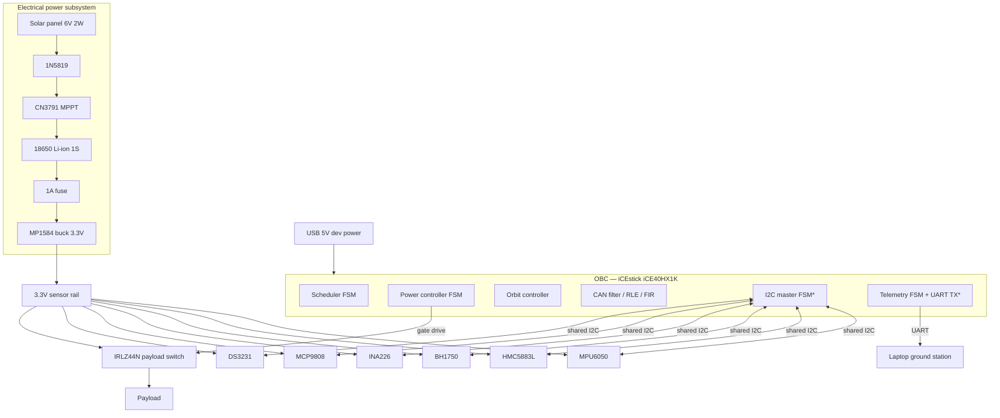
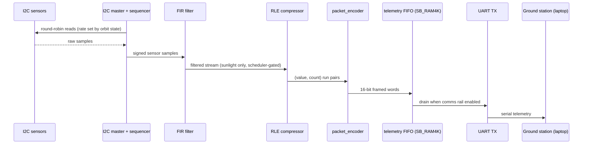
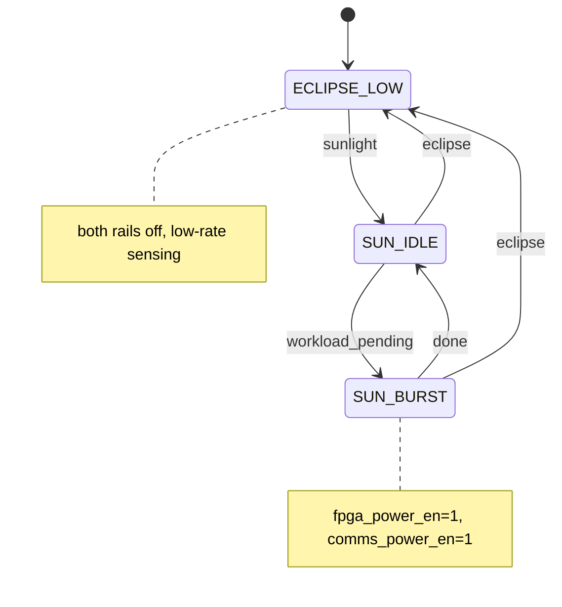
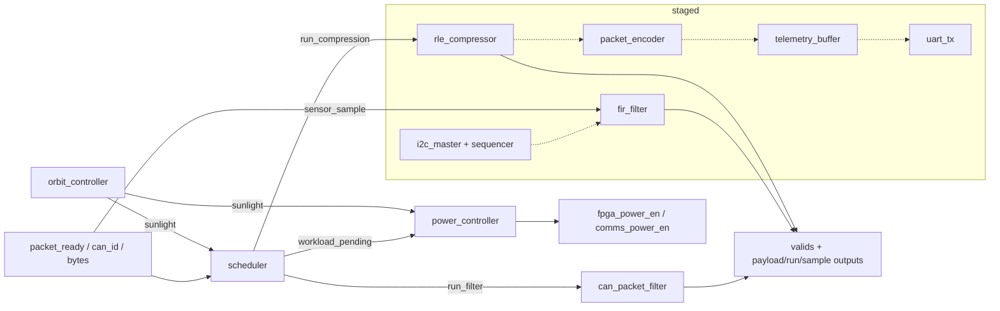

# Jenga CubeSat Prototype — System Architecture

FPGA-based CubeSat On-Board Computer (OBC) prototype. One iCE40HX1K
FPGA implements all control and data-path logic as HDL finite-state
machines: **no soft CPU, no OS, no DSP macros**. This document covers
hardware, power, sensors, communication, telemetry flow, the OBC
itself, module interactions, and the HX1K resource budget.

## 1. Hardware architecture

\* Modules marked with an asterisk are staged (see Roadmap); all others
are implemented and synthesized today.

Design rules: single 12 MHz clock domain; all grounds common; FPGA
powered from USB during development (flight variant would take the
3.3 V rail); every off-chip interface is 3.3 V logic.

## 2. Power architecture

Chain: **Solar panel → 1N5819 → CN3791 MPPT → 18650 → 1 A fuse →
MP1584 → 3.3 V rail → sensors / payload switch**.

| Stage | Part | Function | Notes |
| --- | --- | --- | --- |
| Harvest | 6 V 2 W mono panel | ≤ ~330 mA at Vmp ≈ 6 V | indoor demo uses a desk lamp |
| Reverse block | 1N5819 | stops night-time reverse leakage | ~0.3 V drop |
| Charge | CN3791 | PWM MPPT, CC/CV to 4.20 V, single cell | MPPT setpoint resistor-set to panel Vmp |
| Store | 18650 (1S) | 3.0–4.2 V, ~2.5–3.5 Ah | protected holder, one cell only |
| Protect | 1 A fuse | limits fault current | system worst case < 0.5 A |
| Regulate | MP1584 | buck to 3.3 V | **dropout risk below ~3.6 V battery — see risk P1** |
| Distribute | 3.3 V rail | sensors + payload switch | INA226 monitors rail/battery current |

**Risk P1 (known, accepted for the bench):** MP1584 is buck-only; from
a 1S cell the 3.3 V output loses regulation as the battery approaches
~3.5 V. Mitigations, in preference order: (a) treat SOC < ~30% as
safe-mode cutoff (matches the 35% FPGA-activation threshold in the
policy), (b) swap MP1584 for a buck-boost module, (c) run the rail at
3.0 V (all six sensors accept it). Decision tracked in the roadmap.

The FSM policy maps to real hardware as: `comms_power_en` /
`fpga_power_en` (power_controller.v) → IRLZ44N gate (100 kΩ pulldown +
~220 Ω series gate resistor). IRLZ44N is logic-level; at 3.3 V drive
keep switched loads ≤ ~2 A.

## 3. Sensor architecture

Single shared I2C bus, **one master** (the FPGA), 100 kHz standard
mode, 4.7 kΩ pull-ups to 3.3 V (disable extra breakout pull-ups if the
combined value drops below ~1.5 kΩ).

| Sensor | Measures | I2C address | Role in mission model |
| --- | --- | --- | --- |
| MPU6050 | 3-axis accel + gyro | **`0x69` (AD0 tied high — required!)** | attitude/tumble telemetry |
| HMC5883L | 3-axis magnetometer | `0x1E` | coarse attitude reference |
| BH1750 | ambient light | `0x23` (ADDR low) | **sunlight/eclipse detection** — can replace the free-running orbit counter with measured orbit state |
| INA226 | bus voltage + current (shunt) | `0x40` | **measured power** — turns simulated savings into live measured evidence |
| MCP9808 | temperature | `0x18` | thermal telemetry |
| DS3231 | RTC | `0x68` (fixed) | mission time-stamping; forces MPU6050 to `0x69` |

**Address plan note:** DS3231 is hard-wired to `0x68`, which is the
MPU6050 default — the MPU6050 breakout's AD0 pin must be strapped high.
No other conflicts exist in this suite.

Polling: one round-robin sensor-sequencer FSM behind the single I2C
master; sample rates follow the power policy (10 Hz-class in sunlight,
1 Hz-class in eclipse), mirroring `simulation/subsystems/sensing_module.py`.

## 4. Communication architecture

| Link | Direction | Use |
| --- | --- | --- |
| I2C (shared, FPGA master) | FPGA ↔ sensors | acquisition + RTC |
| UART (3.3 V, 115200 8N1 target) | FPGA → laptop | telemetry downlink stand-in |
| CAN (modeled) | on-board bus in the reference model | the RTL CAN packet filter demonstrates the flight bus policy; the bench has no physical CAN transceiver |

No RF hardware exists anywhere in the prototype. The UHF radio is a
modeled load in the reference simulation only.

## 5. Telemetry flow

Implemented today: FIR → RLE path (synthesized, self-checking TBs);
`packet_encoder`/`telemetry_buffer` exist as verified scaffolds.
Staged: I2C front-end, FIFO drain FSM, real UART TX (roadmap R1–R3).

## 6. OBC architecture

The OBC is three cooperating FSMs plus the datapath, all in
`rtl/top/` (top level `fpga_accelerator_top.v` — the name is retained
for synthesis-report traceability):

- **orbit_controller** — free-running orbit tick (95-tick orbit,
  57 sunlight / 38 eclipse), `PRESCALER` parameter scales tick rate
  (1 = full speed for verification; 1,250,000 = ~10 s orbit on the
  iCEstick LEDs). Roadmap: replace/augment with BH1750 (measured
  sunlight) and DS3231 (absolute time).
- **scheduler** — gates workloads by orbit state: compression only in
  sunlight, filtering whenever packets arrive.
- **power_controller** — comms rail follows sunlight; FPGA burst rail
  requires sunlight AND pending work. Drives the IRLZ44N on the bench.

(Safe-mode/low-SOC shedding exists in the Python policy
(`fpga_activation_policy`) and the reference scenarios; bringing the
SOC threshold into the RTL requires INA226 data — roadmap R4.)

## 7. Module interaction diagram

## 8. iCE40HX1K resource budget

Measured today (nextpnr, `rtl/synthesis_reports/icestick/`): **427 /
1280 LC (33.4%)** including the LED demo wrapper; core alone 157 LUT4 /
120 FF; 0 of 16 BRAM tiles used; Fmax ≈ 104 MHz vs 12 MHz required.

| Planned addition | Estimated LC | Basis |
| --- | ---: | --- |
| I2C master (byte-level FSM, 100 kHz) | 150–250 | typical minimal open-source masters |
| Sensor sequencer + result store | 150–300 | round-robin FSM; results in **SB_RAM4K, not FFs** |
| UART TX 115200 (TX only) | 60–120 | baud counter + shift register |
| Telemetry FSM + framing + FIFO drain | 100–200 | reuse packet_encoder; FIFO in BRAM |
| Payload switch control + soft-start | 10–30 | counter + comparator |
| **Projected total (with today's 427)** | **~900–1330** | **70–104% of HX1K** |

Fit rules to stay inside the device (nextpnr routing degrades above
~85% ≈ 1090 LC): keep all buffering in the 16 unused BRAM tiles; one
shared I2C master (never per-sensor logic); single clock domain; no
multipliers (FIR stays shift-add); width-minimize counters; if the
budget still overflows, drop the CAN demo path from the board build
(−~60 LC) before touching anything else. Growth path if the full
telemetry stack lands: iCE40UP5K (5280 LC, 30× BRAM + SPRAM) with the
identical open-source flow.
